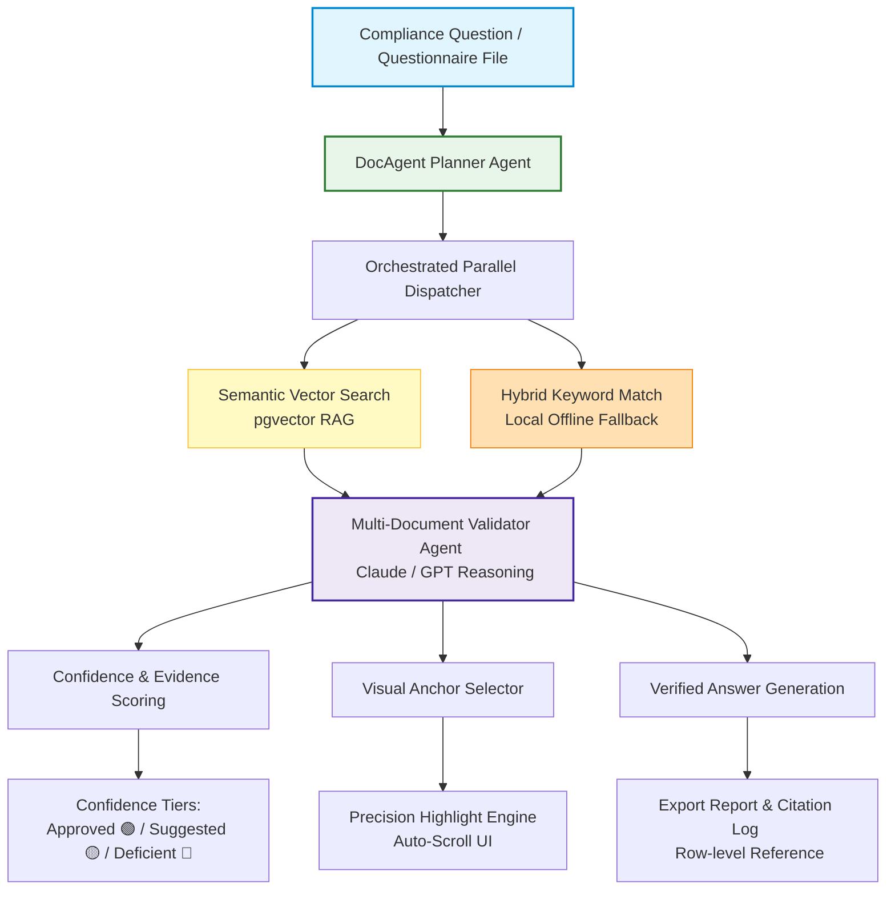

# DocAgent — Enterprise AI Agent Platform

[](https://youtu.be/AXWbFVKlzkM)
[](LICENSE)
[](docker-compose.demo.yml)

DocAgent is a next-generation enterprise multi-document intelligence engine designed to automate complex security questionnaires (CAIQ, SIG, NIST, VSA, ISO 27001), compliance audits, and ESG assessments using intelligent AI agents.

---

## 🎥 90-Second Product Demo

Watch DocAgent automate a 10-question compliance checklist in real-time, scanning over 1,000 reference controls, highlighting matching clauses, and generating verified answers with confidence scores:

▶ **[Watch the full demo on YouTube](https://youtu.be/AXWbFVKlzkM)**

---

## 🛠️ Repository Status & IP Notice

> [!IMPORTANT]
> The source code is private due to commercial and intellectual property considerations. Technical discussions, architecture reviews, and live demonstrations are available upon request.
> 
> If you are interested in the technical implementation or an enterprise pilot, please feel free to contact us at **happycodinglabs@gmail.com**.

This repository contains the **Public Demo Assets** of the DocAgent platform, showing the frontend simulation layers, sample data generator, architecture, and deployment configurations.

---

## 🏗️ System Architecture



---

## 🌟 Key Features

- **Multi-Document Cross-Referencing:** Parallel scanning across multiple framework control sheets (SIG, NIST, ISO 27001, etc.).
- **High-Precision Visual Highlighting:** Real-time visual tracking of matches using pulsing highlight overlays on target evidence.
- **Confidence Tiering:** Automatic sorting into three tiers:
  - 🟢 **Approved** (High Confidence)
  - 🟡 **Suggested Review** (Requires Human Attention)
  - 🔴 **Evidence Deficient** (Missing / Invalid Evidence)
- **Offline Hybrid RAG Fallback:** Dual retrieval system that seamlessly transitions to local keyword search if remote vector database endpoints go offline.
- **Enterprise-Grade Security:** Supports secure, containerized, self-hosted deployment to guarantee your company data never leaves your environment.

---

## 💻 Tech Stack

- **Backend:** Python, FastAPI, SQLModel, PostgreSQL
- **Frontend & UI:** HTML5, CSS3, JavaScript (Vanilla ES6), Next.js (Enterprise suite)
- **Orchestration & DevOps:** Docker, Docker Compose
- **Agent Framework:** Custom LangChain & LLM-based autonomous routing planners
- **Media & Sync:** Microsoft SAPI TTS engine with custom DSP linear cross-fade boundary click prevention

---

## 📁 Repository Structure

```
aiagent-master/
├── docagent_clean_mvp/         # Public Frontend & Demo Simulation Layer
│   ├── demo_ui.html            # 90s Multi-Document Animation Simulator
│   ├── output/
│   │   ├── demo_audio_en.wav   # High-Fidelity English Male Narration (109s)
│   │   └── demo_subtitles_v2.srt# Aligned SRT Subtitles
│   └── sample_data/
│       ├── raw_excels/         # 10 Compliance Framework Policy Sheets (100+ rows each)
│       └── generate_framework_excels.py # Policy database generator script
│
├── LICENSE                     # Proprietary License
├── docker-compose.demo.yml     # Demo container orchestration configuration
└── README.md                   # This overview
```

---

## 🚀 How to Run the Local Demo

To run the interactive browser simulation layer locally:

1. Clone this repository:
   ```bash
   git clone https://github.com/HappyCoding5957/aiagent-master.git
   cd aiagent-master/docagent_clean_mvp
   ```

2. Start a local server:
   ```bash
   python -m http.server 8000
   ```

3. Open your browser and navigate to:
   [http://localhost:8000/demo_ui.html](http://localhost:8000/demo_ui.html)

4. Load the generated English narration [demo_audio_en.wav](docagent_clean_mvp/output/demo_audio_en.wav) and subtitles [demo_subtitles_v2.srt](docagent_clean_mvp/output/demo_subtitles_v2.srt) in your player or video editor (e.g., CapCut) to inspect the alignment.

---

## 🤝 Contact & Enterprise Pilots

HappyCoding Labs specializes in building custom Enterprise AI Agents, Document Intelligence pipelines, and Physical AI (Robotics / Computer Vision) solutions.

- **Founder:** Frank Fu
- **Email:** happycodinglabs@gmail.com
- **LinkedIn Dynamic:** [HappyCoding Labs on LinkedIn](https://www.linkedin.com/posts/frank-fu-6b69a5411_docagent-enterprise-ai-agent-platform-share-7487181786436001792-NLnD/)
