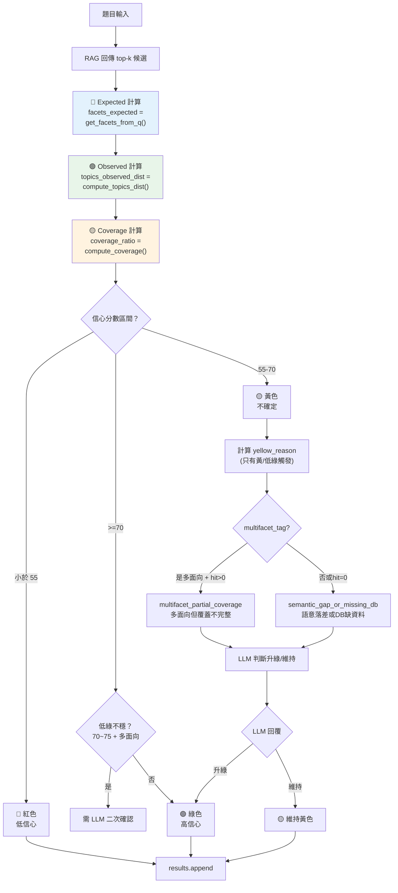
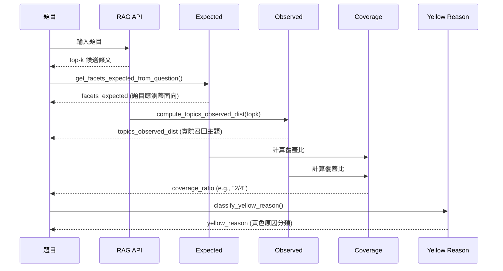

# RPA Security-C：Expected vs Observed vs Coverage 機制詳解

> 版本：2026-03-04  
> 來源檔案：`/home/lladm/frank/server_chatbot/docs/rpa_security_c.py`

---

## 1. 設計核心精神

| 概念 | 意義 | 來源 |
|------|------|------|
| **Expected** | 命題期望（題目說要考什麼） | 從題目文字用硬規則抽取 |
| **Observed** | 實際召回（RAG 找到了什麼） | 從 RAG top-k 候選條文統計 |
| **Coverage** | 期望 vs 現實的差距 | Expected 被 Observed 覆蓋的比率 |

> 這機制就是要回答：「題目說要涵蓋 4 個面向，但 RAG 只召回 2 個，當然會黃！」

---

## 2. 🔵 Expected（題目面向）

**代碼位置**：`rpa_security_c.py:140-162`

### 2.1 get_facets_expected_from_question()

```python
def get_facets_expected_from_question(question: str, q_schema=None) -> list:
    """題目 facets（Expected）：只看題目，不看候選。"""
    q = (question or "").strip()

    # 四大計畫 → 4個面向
    if "四大計畫" in q or ("母性保護" in q and "過負荷" in q):
        return ["母性", "不法侵害", "過負荷", "人因"]

    # 生命安全裝置 → 4個面向
    if "生命安全裝置" in q:
        return ["洗眼/沖淋", "氣體偵測", "消防/排煙", "緊急應變"]

    return []
```

### 2.2 is_multifacet_question_expected()

```python
def is_multifacet_question_expected(question: str, q_schema=None) -> bool:
    """題目本身（Expected）是否多面向。"""
    facets = get_facets_expected_from_question(question, q_schema=q_schema)
    if facets:
        return True

    q = (question or "").strip()
    has_examples = ("例" in q and "：" in q) or ("例如" in q)
    has_list = ("、" in q) or ("(" in q and ")" in q)
    return bool(has_examples and has_list)
```

### 2.3 設計原因

| 原因 | 說明 |
|------|------|
| **不看 RAG 結果** | 確保穩定可審計，不受召回品質影響 |
| **題目說什麼，就預期什麼** | 從命題角度出發，而不是從資料庫角度 |
| **硬規則抽取** | 明確、可追蹤、易於人工驗證 |

### 2.4 facets 硬規則對照表

```
題目含「四大計畫」或（「母性保護」且「過負荷」）
  → facets_expected = ["母性", "不法侵害", "過負荷", "人因"]

題目含「生命安全裝置」
  → facets_expected = ["洗眼/沖淋", "氣體偵測", "消防/排煙", "緊急應變"]

其他
  → facets_expected = []（非多面向，coverage_ratio = "-"）
```

---

## 3. 🟢 Observed（召回主題）

**代碼位置**：`rpa_security_c.py:165-202`

### 3.1 infer_topic_from_candidate()

```python
def infer_topic_from_candidate(candidate: dict) -> str:
    """候選 topics（Observed）：從 top-k candidates 觀察召回主題。"""
    matches = candidate.get("matches") or []
    text = " ".join([
        str(candidate.get("behavior") or ""),
        str(candidate.get("article") or ""),
        " ".join([str(m.get("keyword") or "") for m in matches]),
        " ".join([str(m.get("impact") or "") for m in matches]),
    ])

    # 關鍵字對照表
    rules = [
        ("母性", ["母性", "女性勞工", "妊娠", "孕", "哺乳"]),
        ("過負荷", ["過負荷", "異常工作負荷", "促發疾病", "長工時", "疲勞"]),
        ("不法侵害", ["不法侵害", "職場暴力", "霸凌", "騷擾", "侵害"]),
        ("人因", ["人因", "肌肉骨骼", "重複性", "姿勢", "搬運", "工效"]),
        ("消防/排煙", ["消防", "排煙", "警報", "火災"]),
        ("氣體偵測", ["氣體", "偵測", "毒性", "監控"]),
        ("洗眼/沖淋", ["洗眼", "沖淋", "緊急沖淋", "急救"]),
        ("緊急應變", ["緊急應變", "應變程序", "應變櫃", "緊急應變櫃"]),
    ]

    for key, kws in rules:
        for kw in kws:
            if kw in text:
                return key

    # 無法識別時，回傳行為準則前20字
    b = (candidate.get("behavior") or "").strip()
    return _normalize_topic_token(b[:20] if b else "OTHER")
```

### 3.2 compute_topics_observed_dist()

```python
def compute_topics_observed_dist(topk: list) -> dict:
    """topics_observed_dist（Observed）統計。"""
    dist = {}
    for c in (topk or []):
        k = infer_topic_from_candidate(c)
        k = _normalize_topic_token(k) or "OTHER"
        dist[k] = dist.get(k, 0) + 1
    return dist
    # 回傳範例: {"母性": 8, "人因": 3, "OTHER": 9}
```

### 3.3 設計原因

| 原因 | 說明 |
|------|------|
| **反映 DB 現況** | 實際召回什麼主題一目瞭然 |
| **統計 top-20 全部候選** | 而非只看 top-1，確保全面評估 |
| **關鍵字匹配** | 快速識別候選條文所属主题 |

### 3.4 topic 推算關鍵字對照表

| 主題 | 關鍵字（任一命中） |
|------|----------------|
| 母性 | 母性、女性勞工、妊娠、孕、哺乳 |
| 過負荷 | 過負荷、異常工作負荷、促發疾病、長工時、疲勞 |
| 不法侵害 | 不法侵害、職場暴力、霸凌、騷擾、侵害 |
| 人因 | 人因、肌肉骨骼、重複性、姿勢、搬運、工效 |
| 消防/排煙 | 消防、排煙警報、火災 |
| 氣體偵測 | 氣體、偵測、毒性、監控 |
| 洗眼/沖淋 | 洗眼、沖淋、緊急沖淋、急救 |
| 緊急應變 | 緊急應變、應變程序、應變櫃 |
| OTHER | 以上皆不符 |

---

## 4. 🟡 Coverage（覆蓋比）

**代碼位置**：`rpa_security_c.py:205-215`

### 4.1 compute_facet_coverage_expected_vs_observed()

```python
def compute_facet_coverage_expected_vs_observed(facets_expected: list, topics_observed_dist: dict) -> tuple:
    """Expected facets 覆蓋到 Observed topics 的命中數。"""
    if not facets_expected:
        return 0, 0  # 非多面向題

    observed_keys = {_normalize_topic_token(k) for k in (topics_observed_dist or {}).keys()}
    hit = 0
    for facet in facets_expected:
        if _normalize_topic_token(facet) in observed_keys:
            hit += 1
    return hit, len(facets_expected)
    # 回傳: (命中數, 總面向數) → e.g., (2, 4)
```

### 4.2 設計原因

| 原因 | 說明 |
|------|------|
| **量化差距** | 2/4 代表只命中一半，直觀呈現問題 |
| **供 yellow_reason 分類使用** | 根據命中數決定黃色原因類型 |
| **正規化比對** | 使用 `_normalize_topic_token()` 避免變體造成假性偏低 |

### 4.3 _normalize_topic_token() 正規化函式

```python
def _normalize_topic_token(token: str) -> str:
    """將主題名稱/代碼正規化，避免 coverage 假性偏低。"""
    t = (token or "").strip()
    if not t:
        return ""

    mapping = {
        "SVS80038": "人因",
        "SVS080038": "人因",
        "SVS080037": "母性",
        "SAS100050": "過負荷",
        "母性需求": "母性",
        "女性勞工": "母性",
        "人因性危害": "人因",
        "異常工作負荷": "過負荷",
        "職場不法侵害": "不法侵害",
        "職場暴力": "不法侵害",
        "霸凌": "不法侵害",
        "騷擾": "不法侵害",
    }

    for k, v in mapping.items():
        if k in t:
            return v

    if "母性" in t:
        return "母性"
    if "人因" in t or "肌肉骨骼" in t:
        return "人因"
    if "過負荷" in t or "長工時" in t or "疲勞" in t:
        return "過負荷"
    if "不法侵害" in t or "暴力" in t or "霸凌" in t or "騷擾" in t:
        return "不法侵害"
    if "消防" in t or "排煙" in t or "火警" in t:
        return "消防/排煙"
    if "氣體" in t or "偵測" in t or "監控" in t:
        return "氣體偵測"
    if "洗眼" in t or "沖淋" in t or "急救" in t:
        return "洗眼/沖淋"
    if "緊急應變" in t or "應變程序" in t:
        return "緊急應變"

    return t
```

---

## 5. 🚦 這三者如何影響題目處理流程

### 5.1 完整處理流程圖



### 5.2 Expected/Observed/Coverage 計算時機



---

## 6. 📊 判斷邏輯總整理

### 6.1 分數區間與顏色

| 信心分數 | 顏色 | 說明 |
|----------|------|------|
| < 55 | 🔴 紅色 | 低信心匹配 |
| 55-70 | 🟡 黃色 | 不確定，需人工或 LLM 判斷 |
| ≥ 70 | 🟢 綠色 | 高信心匹配 |

### 6.2 黃色原因分類

| 狀態 | 信心分數 | multifacet_tag | coverage_ratio | yellow_reason |
|------|----------|-----------------|----------------|----------------|
| 🟡 黃 | 55-70 | **True** | **2/4** | `multifacet_partial_coverage` |
| 🟡 黃 | 55-70 | False 或 hit=0 | - | `semantic_gap_or_missing_db` |

### 6.3 低綠不穩定判斷

| 狀態 | 信心分數 | multifacet_tag | 處理方式 |
|------|----------|----------------|----------|
| 🟢 綠 | ≥75 | - | 直接標綠 |
| 🟢 綠 | 70-75 | **True** | 需 LLM 二次確認 |

### 6.4 yellow_reason 分類邏輯

```python
def classify_yellow_reason_expected_vs_observed(multifacet_tag: bool,
                                               facets_expected: list,
                                               topics_observed_dist: dict) -> str:
    """黃色原因分類（Expected vs Observed）。"""
    if multifacet_tag and facets_expected:
        hit, total = compute_facet_coverage_expected_vs_observed(
            facets_expected, topics_observed_dist
        )
        if total > 0 and hit > 0:
            return "multifacet_partial_coverage"  # 多面向但覆蓋不完整
        return "semantic_gap_or_missing_db"       # 語意落差或DB缺資料
    return "semantic_gap_or_missing_db"
```

### 6.5 建議動作對照

| yellow_reason | 意義 | 建議動作 |
|----------------|------|----------|
| `multifacet_partial_coverage` | 題目需複選，但 RAG 只選出一條，覆蓋不完整 | 補充缺漏條文到 DB；或人工確認複選 |
| `semantic_gap_or_missing_db` | 題目語意與 DB 條文距離遠，或 DB 根本缺對應文件 | 確認知識庫是否有上傳相關政策文件 |

---

## 7. 📋 輸出欄位說明

### 7.1 新增欄位

| 欄位名稱 | 類型 | 說明 |
|----------|------|------|
| `multifacet_tag` | bool | 是否多面向題目 |
| `facets_expected` | list | 題目應涵蓋的面向清單 |
| `topics_observed_dist` | dict | RAG 實際召回的主題分布 |
| `coverage_ratio` | str | 覆蓋比 (e.g., "2/4" 或 "-") |
| `yellow_reason` | str | 黃色原因分類 |

### 7.2 完整輸出範例

```python
results.append({
    "row_index": row_idx,
    "question": question,
    "matched": True,
    "confidence": confidence,
    "department": department_text,
    "status": ...,
    "behavior": behavior,
    "match_count": len(matches),
    # NEW
    "multifacet_tag": multifacet_tag,
    "facets_expected": facets_expected,
    "topics_observed_dist": topics_observed_dist,
    "topic_dist": topic_dist,          # 兼容舊鍵名
    "coverage_ratio": coverage_ratio,
    "yellow_reason": yellow_reason,
})
```

---

## 8. 🔧 實際測試結果範例

### 8.1 Q12（生命安全裝置）

| 項目 | 值 |
|------|-----|
| multifacet_tag | True |
| facets_expected | `["洗眼/沖淋", "氣體偵測", "消防/排煙", "緊急應變"]` |
| topics_observed_dist | `{"緊急應變":1, "消防/排煙":1, ...}` |
| coverage_ratio | **2/4** |
| yellow_reason | `multifacet_partial_coverage` |

### 8.2 Q17（四大計畫）

| 項目 | 值 |
|------|-----|
| multifacet_tag | True |
| facets_expected | `["母性", "不法侵害", "過負荷", "人因"]` |
| topics_observed_dist | `{"母性":4, "人因":2, ...}` |
| coverage_ratio | **2/4** |
| yellow_reason | `multifacet_partial_coverage` |

### 8.3 Q4（高層政策）

| 項目 | 值 |
|------|-----|
| multifacet_tag | False |
| facets_expected | `[]` |
| topics_observed_dist | `{OTHER: N}` |
| coverage_ratio | `-` |
| yellow_reason | `semantic_gap_or_missing_db` |

---

## 9. ❓ 為什麼要這樣設計？

### 9.1 問題根源

人工審查稽核結果發現，某些題目系統答案與同仁判斷不一致，特別是：
- **Q12**：危害性操作區域生命安全裝置（涵蓋4種設施，複選）
- **Q17**：勞工健康保護四大計畫（橫跨4個子法規，複選）

這些題目的共同特點：**題目多面向、單一條文無法完整覆蓋**。

### 9.2 設計原則

| 層面 | 說明 |
|------|------|
| **Expected（題目 facets）** | 從題目本身抽取「理論上應涵蓋的面向清單」，完全不依賴 RAG 結果，穩定可審計 |
| **Observed（候選 topics）** | 從 RAG top-k 候選條文統計「實際召回落在哪些主題」，反映 DB 現況 |
| **Coverage（覆蓋比）** | 計算 Expected 面向被 Observed 覆蓋的命中數（`hit/total`） |
| **不改既有輸出** | D/E 欄、H 欄、三色規則、skip 跳題邏輯全部保留不動 |
| **先標籤、後決策** | 每題都計算多面向標記，但只在黃區才觸發 yellow_reason 分類 |

### 9.3 期望達成目標

1. **識別多面向題目**：自動偵測需要複選的題目
2. **量化覆蓋差距**：明確知道 RAG 召回不足
3. **提供改善方向**：透過 yellow_reason 知道該補什麼條文
4. **不影響既有流程**：舊有功能維持不變

---

## 10. 📚 相關檔案

| 檔案 | 說明 |
|------|------|
| `rpa_security_c.py` | 主要程式碼（含 Expected/Observed 機制） |
| `rpa_security_c_expected_observed_修改說明_20260304.md` | 完整修改說明文件 |
| `rpa_security_c.py.bak_20260304_expected_observed` | 備份檔案 |

---

## 11. ⚠️ 重要問題：目前是寫死的！

### 11.1 觀察發現

> **你說對了！** 目前 `facets_expected` 和 `infer_topic` 的關鍵字對照**确实是写死的**：

| 項目 | 目前狀態 | 問題 |
|------|----------|------|
| `facets_expected` | **寫死** `"四大計畫"`、`"生命安全裝置"` | 只能處理這2種題型 |
| `infer_topic` keywords | **寫死** 8組關鍵字對照 | 新題型就要改 code |
| `rules` 推算主題 | **寫死** 硬規則 | 無法擴展 |

### 11.2 寫死的代碼一覽

```python
# facets_expected - 寫死（第140-150行）
def get_facets_expected_from_question(question: str, q_schema=None) -> list:
    if "四大計畫" in q or ("母性保護" in q and "過負荷" in q):
        return ["母性", "不法侵害", "過負荷", "人因"]
    if "生命安全裝置" in q:
        return ["洗眼/沖淋", "氣體偵測", "消防/排煙", "緊急應變"]
    return []
```

```python
# infer_topic - 寫死（第175-184行）
rules = [
    ("母性", ["母性", "女性勞工", "妊娠", "孕", "哺乳"]),
    ("過負荷", ["過負荷", "異常工作負荷", "促發疾病", "長工時", "疲勞"]),
    ("不法侵害", ["不法侵害", "職場暴力", "霸凌", "騷擾", "侵害"]),
    ("人因", ["人因", "肌肉骨骼", "重複性", "姿勢", "搬運", "工效"]),
    ("消防/排煙", ["消防", "排煙", "警報", "火災"]),
    ("氣體偵測", ["氣體", "偵測", "毒性", "監控"]),
    ("洗眼/沖淋", ["洗眼", "沖淋", "緊急沖淋", "急救"]),
    ("緊急應變", ["緊急應變", "應變程序", "應變櫃", "緊急應變櫃"]),
]
```

### 11.3 為什麼目前是寫死的？

| 原因 | 說明 |
|------|------|
| **第一版驗證** | 先用已知題型驗證機制可行性 |
| **快速上線** | 不用等 LLM 整合，直接用規則 |
| **效能考量** | 硬規則比 LLM 呼叫快且便宜 |
| **可控性** | 寫死的規則可預測、可審計 |

---

## 12. 🎯 黃色處理流程：何時判定多面向？何時升綠？

### 12.1 黃色區間處理流程

```
┌─────────────────────────────────────────────────────────────┐
│                    黃色區間處理流程                          │
└─────────────────────────────────────────────────────────────┘

    題目進入黃色區間 (55-70分)
              │
              ▼
    ┌─────────────────────┐
    │  計算 yellow_reason  │
    │  (黃/低綠才觸發)     │
    └──────────┬──────────┘
               │
               ▼
    ┌──────────────────────────┐
    │  multifacet_tag = True?  │
    │  且 hit > 0?              │
    └──────────┬───────────────┘
         是 ↙         ↘ 否
    ┌──────────────┐  ┌────────────────────┐
    │ multifacet   │  │ semantic_gap_or    │
    │ _partial     │  │ _missing_db        │
    │ _coverage    │  │                    │
    └──────┬───────┘  └─────────┬──────────┘
           │                     │
           └─────────┬───────────┘
                     ▼
           ┌─────────────────────┐
           │    送 LLM 判斷      │
           │  "請問題目是否正確?" │
           └──────────┬──────────┘
                      │
            ┌────────┴────────┐
            ▼                 ▼
        LLM: Y             LLM: N
            │                 │
            ▼                 ▼
        🟢 升綠          🟡 維持黃
```

### 12.2 判斷邏輯解答

| 問題 | 答案 |
|------|------|
| 黃色什麼情況下判定多面向？ | 信心分數 55-70 且 `multifacet_tag=True` |
| 什麼情況下升級綠色？ | LLM 判斷回答 "Y" → 升綠 |
| 什麼情況下維持黃色？ | LLM 判斷回答 "N" → 維持黃 |

### 12.3 yellow_reason 分類對照

| yellow_reason | 觸發條件 | LLM 結果 | 最終顏色 |
|---------------|----------|----------|----------|
| `multifacet_partial_coverage` | 多面向題 + 部分命中 | Y → 🟢 升綠<br>N → 🟡 維持 | 取決於 LLM |
| `semantic_gap_or_missing_db` | 非多面向或 hit=0 | Y → 🟢 升綠<br>N → 🟡 維持 | 取決於 LLM |

---

## 13. 🚀 優化方向：如何擺脫寫死？

### 13.1 三階段演進

```
階段一（現況）          階段二（優化）              階段三（理想）
┌─────────┐             ┌─────────────┐            ┌──────────────┐
│ 寫死規則 │        →    │ 半自動擴展   │       →     │ 全動態抽取   │
│ 2種題型  │             │ 新題型可配置  │            │ LLM 自動識別  │
└─────────┘             └─────────────┘            └──────────────┘
   ▲                         ▲                          ▲
   │                         │                          │
   └─────────────────────────┴──────────────────────────┘
                    演進方向
```

### 13.2 階段二：設定檔驅動（推薦）

**把 keywords/facets 放到 YAML 設定檔**，新增題型只要改設定檔：

```yaml
# config/multifacet_rules.yaml
version: 1.0

rules:
  # 四大計畫
  - name: "四大計畫"
    facets: ["母性", "不法侵害", "過負荷", "人因"]
    trigger_keywords: 
      - "四大計畫"
      - "母性保護"
      - "過負荷"
    topic_keywords:
      母性: ["母性", "女性勞工", "妊娠", "孕", "哺乳"]
      過負荷: ["過負荷", "異常工作負荷", "促發疾病", "長工時", "疲勞"]
      不法侵害: ["不法侵害", "職場暴力", "霸凌", "騷擾", "侵害"]
      人因: ["人因", "肌肉骨骼", "重複性", "姿勢", "搬運", "工效"]

  # 生命安全裝置
  - name: "生命安全裝置"
    facets: ["洗眼/沖淋", "氣體偵測", "消防/排煙", "緊急應變"]
    trigger_keywords:
      - "生命安全裝置"
    topic_keywords:
      洗眼/沖淋: ["洗眼", "沖淋", "緊急沖淋", "急救"]
      氣體偵測: ["氣體", "偵測", "毒性", "監控"]
      消防/排煙: ["消防", "排煙", "警報", "火災"]
      緊急應變: ["緊急應變", "應變程序", "應變櫃"]

  # 👉 新增題型範例
  - name: "職業安全衛生管理"
    facets: ["安全衛生組織", "危害辨識", "風險評估", "緊急應變"]
    trigger_keywords:
      - "職業安全衛生管理"
      - "安全衛生組織"
    topic_keywords:
      安全衛生組織: ["安全衛生", "管理組織", "職安"]
      危害辨識: ["危害", "辨識", "危險因子"]
      ...
```

**優點**：
- 新增題型**不用改 code**
- 人工維護設定檔即可
- 可版本控制設定檔

### 13.3 階段三：LLM 動態抽取（理想）

**用 LLM 自動從題目/答案抽取面向和主題**：

```python
# ✅ 理想：LLM 動態抽取 Expected
def get_facets_expected_dynamic(question: str) -> list:
    """用 LLM 從題目自動抽取面向"""
    prompt = f"""
題目：{question}

請分析這題涉及哪些面向/主題？
請以 JSON array 回覆。
例如：["母性保護", "過負荷", "不法侵害", "人因"]

只需要回覆 JSON，不要其他文字。
    """
    response = llm.chat(prompt)
    try:
        return json.loads(response)
    except:
        return []

# ✅ 理想：LLM 動態推算 Observed
def infer_topic_dynamic(candidate: dict) -> str:
    """用 LLM 從候選條文自動推算主題"""
    text = candidate.get("behavior", "") + " " + candidate.get("article", "")
    prompt = f"""
條文內容：{text}

這條文屬於哪個主題？請回覆簡短主題名稱（2-4個字）。
例如：母性保護、過負荷、人因、消防設備

只需要回覆主題名稱，不要其他文字。
    """
    response = llm.chat(prompt)
    return response.strip()

# ✅ 動態 Coverage 計算
def compute_coverage_dynamic(facets_expected: list, topics_observed: list) -> dict:
    """動態比對 Expected vs Observed"""
    hit = 0
    for facet in facets_expected:
        # 用相似度而非精確匹配
        for topic in topics_observed:
            if fuzzy_match(facet, topic):  # 模糊匹配
                hit += 1
                break
    return {
        "hit": hit,
        "total": len(facets_expected),
        "ratio": f"{hit}/{len(facets_expected)}" if facets_expected else "-"
    }
```

**優點**：
- **完全不用寫規則**
- 適用於**任意題型**
- 自動學習新主題

**缺點**：
- 需要 LLM API 成本
- 回應速度較慢
- 需處理 LLM 回覆格式

### 13.4 混合方案（推薦過渡）

```
┌─────────────────────────────────────────────────────────────┐
│                    混合方案架構                              │
└─────────────────────────────────────────────────────────────┘

    題目輸入
       │
       ▼
    ┌─────────────────────┐
    │  檢查設定檔規則      │ ◄── 優先使用設定檔
    │  (YAML/資料庫)      │
    └──────────┬──────────┘
               │ 找不到對應規則?
               ▼ 是
    ┌─────────────────────┐
    │   LLM 動態抽取      │ ◄── 回退機制
    │  (兜底方案)         │
    └─────────────────────┘
```

**邏輯**：
1. **先查設定檔**：有對應規則就用（快速、穩定）
2. **查不到就問 LLM**：自動抽取（彈性、擴展）

---

## 14. 📋 總結

| 問題 | 目前狀態 | 優化方向 |
|------|----------|----------|
| facets 是寫死的？ | 是，只支援 2 種題型 | 放 YAML 設定檔 |
| keywords 是寫死的？ | 是，8 組關鍵字 | 放 YAML 設定檔 |
| 新題型要加規則？ | 需改 code | 改設定檔即可 |
| 完全不寫死？ | ❌ | 用 LLM 動態抽取 |

**建議優先實作階段二（設定檔驅動）**，因為：
1. 改動最小，風險最低
2. 效能與可控性兼顧
3. 未來可平滑過渡到階段三
